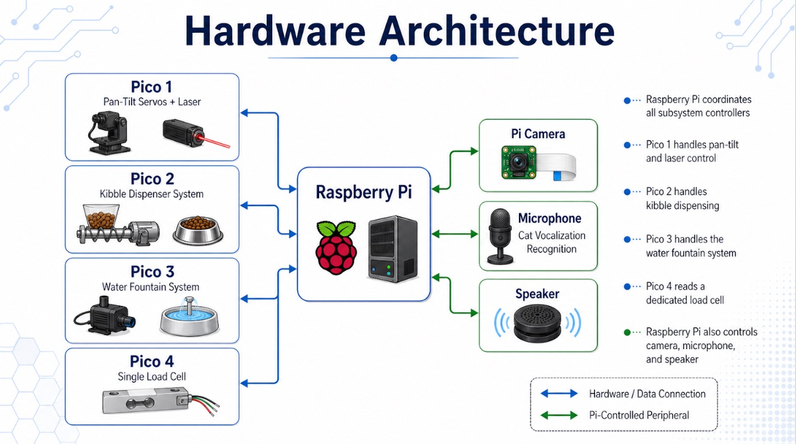

# Final - Proposal

## 1. Team Information
- **Team Name:** Catopia
- **Team Members:**
  - **Matthew Yue** (matthewyue@brandeis.edu) – Mechanical Engineer & Data Scientist
  - **Garret Rieden** (grieden11@brandeis.edu) – Hardware Engineer
  - **Adam Rieden** (arieden@brandeis.edu) – Frontend Developer
  - **Yuxuan Liu** (yuxuanliu050613@brandeis.edu) – Backend Developer
- **Github Repository:** https://github.com/MatthewYyf/catopia-smart-home.git
- **Demo Link:** (if any)

## 2. Abstract
Provide a concise summary (150–250 words) describing:
- The problem you are addressing
  - Cats can experience stress, boredom, and loneliness when their owners are not present for long periods of time. Although cats are often seen as independent animals, they still need regular stimulation, feeding consistency, hydration, and social interaction to maintain good mental and physical health. When these needs are not met, cats may show signs of anxiety, reduced activity, excessive vocalization, overeating, under-eating, or changes in drinking behavior. However, owners are often unable to observe these changes in real time while they are away from home.

  - This project addresses the problem of remote cat care by creating an automated smart cat house that monitors and supports a cat’s daily behavior. The system tracks food and water intake, detects vocalizations, provides camera-based observation, and allows remote control of interactive features such as feeding and laser play. By combining sensors, audio recognition, and automated actuation, the system helps owners better understand their cat’s condition when they are not physically present.

  - The goal is to reduce the gap between owner absence and pet care. Instead of only reacting after a problem becomes noticeable, the system provides continuous monitoring and enrichment, helping support the cat’s mental health, comfort, and routine throughout the day.
- Brief description about your proposed project
  - Our proposed project is a smart cat house that helps owners monitor and care for their cats when they are away. The system combines sensors, cameras, audio recognition, and automated devices to support the cat’s daily routine and mental well-being.
The Raspberry Pi acts as the central controller, running the backend server, frontend dashboard, camera stream, and audio processing. Multiple Raspberry Pi Pico devices control specific hardware modules, including the food dispenser, water fountain, load cells, and pan-tilt laser toy. The system tracks food and water intake, detects cat vocalizations, streams video, and allows the owner to remotely trigger actions such as feeding or interactive play.
  - A key goal of the project is to reduce stress, boredom, and uncertainty for both the cat and the owner. By monitoring behavior patterns and providing enrichment when the owner is not present, the smart cat house creates a more responsive care environment. The system also records useful data over time, which can help identify changes in eating, drinking, or vocalization behavior that may reflect the cat’s comfort, health, or emotional state.
- Key technologies involved
  - The project uses a combination of embedded hardware, web software, and machine learning technologies. A Raspberry Pi serves as the main computing unit, running the FastAPI backend, frontend dashboard, camera stream, database, and audio processing services. Raspberry Pi Pico microcontrollers run MicroPython and control individual hardware modules such as the food dispenser, water fountain, load cells, and pan-tilt laser system.

  - The system uses REST API communication between the Raspberry Pi and Pico devices. Telemetry endpoints collect sensor data, while command endpoints allow the backend to send actions such as dispensing food, turning on the pump, or starting laser play. Load cells with HX711 amplifiers measure food, water, and body weight. Servos, a stepper motor, relay, and pump provide physical actuation.

  - For monitoring, the system uses a Pi Camera for live video streaming and a microphone for cat vocalization detection. Audio features such as MFCCs are extracted and classified using class-specific Hidden Markov Models with Gaussian Mixture Models. The frontend dashboard displays live status, sensor readings, camera output, and control buttons for remote interaction.
- Final results and impact
  - The final prototype demonstrates the main functions of a smart cat house, including food dispensing, water monitoring, load cell sensing, camera streaming, microphone input, and remote control through a web dashboard. The Raspberry Pi backend communicates with multiple Raspberry Pi Pico controllers, allowing sensor data and device commands to move through one connected system. As a technical prototype, the project shows that these hardware and software components can be integrated into a single embedded system for remote pet care.

  - However, the product was not tested on real cats, so its actual impact on cat mental health and behavior is unclear. While the system is designed to support enrichment, routine, and owner awareness, the project cannot yet prove that it reduces stress, boredom, or loneliness in real-world use. Cat behavior can vary widely, and future testing would be needed to evaluate whether the laser play, feeding automation, audio recognition, and monitoring features are useful and safe for actual pets.

  - Therefore, the project should be understood mainly as a proof of concept. It demonstrates a possible direction for smart pet care systems, but further validation, user testing, and animal-centered evaluation would be required before making strong claims about its practical impact.

## 3. Project Details
Describe the details about your project

### 3.1 Project Description
High-level description of the system.
As detailed as possible.

### 3.2 Hardware Components
| Component | Description | Quantity |
|---------|-------------|----------|
| Raspberry Pi | Main controller | 1 |
| Raspberry Pico | Perform specific tasks | 4 |
| Load Cell | Weight Sensor | 3 |
| Camera Module | Watch cat from App | 1 |
| Servo Motor | Move Cat Toy/Laser | 2 |
| Water Pump | Pour water into cat bowl | 1 |
| Wi-fi / Bluetooth module | Connect modules and to app | 1 |
| Housing Enclosure | Main structure everything surrounds or mounted on | 1 |
| Food-safe containers | For food and water storage | 2 |
| Tube | For water system | 1 |
| Mounting brackets + wiring | For all cat equipment | 4 |
| Mic Array | To listen to cat's emotional state | 1 |
| Bluetooth Speaker | Play owners voice memos | 1 |
| Breadboard | Have multiple components for 1 pico | 3 |

- Schematic 

Raspberry Pi represents the main computing and coordination layer of the system. It runs the backend server, manages communication with the Pico, processes sensor and device data, and connects higher-level peripherals such as the camera, microphone, and speaker.

The Pico controllers represent the hardware control layer. Each Pico is assigned to a specific subsystem. Pico 1 represents the interactive laser toy subsystem, controlling the pan-tilt servos and laser module. Pico 2 represents the feeding subsystem, controlling the kibble dispenser mechanism. Pico 3 represents the water subsystem, controlling the water pump and a load cell to track the water intake. Pico 4 represents the weight-sensing subsystem, reading data from a dedicated load cell.

The green connections represent peripherals that are connected directly to the Raspberry Pi. The camera provides the live video feed, the microphone collects audio for cat vocalization recognition, and the speaker supports audio output or voice playback.

### 3.3 Software Components
Catopia’s software system is composed of three main layers, embedded firmware on the Raspberry Pi Pico devices, a Python backend server running on the Raspberry Pi, and a browser-based frontend dashboard. 

First of all, the backend layer is implemented in Python using FastAPI and Uvicorn. FastAPI provides the REST API used by both the frontend and the Pico firmware, while Uvicorn runs the application as a local web server on port 8000. The backend serves the main web interface from backend/static/index.html, receives telemetry from the Pico devices, stores the latest device state, records consumption events, manages reports, and queues hardware commands. The server supports both device-specific endpoints and backward-compatible endpoints.

The backend also includes a lightweight SQLite database. Its primary objective is to permanently store the data regarding user’s cats within the Catopia System. The database schema contains three main tables,  daily_reports, voice_logs, and consumption_events.  Meanwhile, within the backend/db/queries.py, we have implemented functions designed to interact with the database. For example, a function that returns a daily report simply by accepting a specific date as input. This capability allows us to retrieve the desired information from the database more efficiently and conveniently on the frontend. The daily_report  table primarily serves to store daily records of the cat's food intake, water consumption, and body weight. Furthermore, on the frontend reporting page, we utilize functions from the  queries.py to visualize the cat's water intake trends over the preceding seven days. Variations in water intake can serve as an indicator of the cat's renal function status, thereby providing users with timely feedback regarding their cat's health. The voice_logs table is responsible for storing the emotional tags detected from the cat's vocalizations during each run of the affection detection pipeline. Finally, the consumption_events table records the specific food intake quantity determined during each execution of the `backend/services/consumption_tracker.py` script. Its primary objective is to help tracking  the cat's total daily food consumption. 

A key backend service is the consumption tracking system in backend/services/consumption_tracker.py.  We observed that when a cat is eating, the sensor data may be subject to increased noise. For instance, if the cat steps directly onto the sensor. Consequently, we cannot simply determine the amount of food consumed by merely calculating the change between consecutive sensor readings. To address this, we developed `backend/services/consumption_tracker.py`. The tracker begins by recording the five most recent sensor reading. It then utilizes the median value, instead of mean, to prevent sudden spikes or drops in individual readings from skewing the results. If the median values across several consecutive measurement windows remain relatively consistent, the system flags the current state as "stable." Finally, the system compares the readings from two distinct stable states. If a decline is detected, the system validates it as a legitimate instance of food consumption.

Vocalization Recognition:

The goal of this system is to recognize and classify cat meows into three behavioral contexts: food-seeking, isolation, and brushing. To do this, we trained a separate Hidden Markov Model (HMM) for each context using audio recordings labeled under that category. The reason we chose HMMs is that a meow isn't a single, static sound — it evolves over time in terms of pitch, intensity, and spectral content, and HMMs are well-suited to modeling this kind of temporal structure.

To prepare the audio for classification, we extracted Mel-Frequency Cepstral Coefficient (MFCC) features from each recording. The audio was divided into short 30 ms frames with a 10 ms hop between them, and each frame was represented as a 52-dimensional feature vector consisting of 13 MFCC coefficients along with their first and second derivatives. Together, these frame-level vectors form a sequence that captures how the sound changes from start to finish. Before feeding this into the model, we applied z-score normalization to each sequence, which helps reduce variability caused by differences in microphone gain or recording conditions.

Each HMM models the meow as a progression through a series of hidden acoustic states, where each state corresponds to a distinct spectral pattern in the vocalization. To model the feature distribution within each state more accurately, we used a Gaussian Mixture Model (GMM) rather than a single Gaussian, which gives the system more flexibility to capture complex acoustic variation. The models were trained using the Baum-Welch algorithm, which iteratively updates the state transition probabilities and GMM parameters to best fit the training data for each class.

When classifying a new meow, the audio sequence is passed through all three HMMs, and each model computes a log-likelihood score representing how well it explains the observed features. The class whose model produces the highest score is selected as the predicted context — so if the food-related HMM returns the highest log-likelihood, the meow is classified as food-seeking behavior.

One practical challenge we had to address was preventing the system from trying to classify silence or background noise. To handle this, we set an energy threshold on the microphone input: the system continuously monitors incoming audio and calculates the root mean square (RMS) energy of each frame as a proxy for loudness. Frames that fall below the threshold are discarded before any feature extraction takes place, reducing unnecessary computation. Once the energy level exceeds the threshold, the system begins buffering audio until either a minimum clip duration is reached or silence is detected again. We then applied WebRTC voice activity detection to trim any remaining silence from the beginning or end of the clip. This ensures that the HMM receives a clean, complete vocalization rather than a truncated or noisy fragment.

Camera module:

The frontend is a single-page browser dashboard built with HTML, CSS, and JavaScript. It communicates with the backend using the browser fetch() API. The dashboard includes pages for testing live load sensor readings, viewing food and water status, controlling the feeder, controlling the laser toy, viewing the camera stream, checking vocalization results, recording voice memos, and viewing reports. The frontend polls the backend every second for live state updates, then displays values such as current load, filtered load, stable state, baseline value, session total, and daily total. It also sends control commands, such as DISPENSE, PUMP_ON/OFF.

The embedded software is written in MicroPython and organized under the firmware directory. Each Pico folder represents a specific hardware subsystem.   pico_1 handles the pan/tilt laser toy using PWM-controlled servo motors and a laser module. pico_2 is designed for the kibble dispenser, using a stepper motor and HX711-based load sensor to dispense a target amount of food. pico_3  is the water supply subsystem that refill the water tank by controlling the pump and using a load cell to record the cat’s water intake. The firmware connects to the local Catopia Wi-Fi network, sends JSON telemetry to the backend about once per second, and polls the backend for queued commands. 

Catopia uses a two-direction data flow. Sensor data moves upward from the hardware to the user interface, while user commands move back downward from the dashboard to the physical devices. On the data side, sensors and actuators first interact with the real cat home environment. Load cells measure food or water weight, the pump controls water output, the feeder controls food dispensing, and the servo motors control the laser toy. These components are connected to Raspberry Pi Pico and it will send telemetry as JSON data through HTTP requests over the local Catopia network to the Raspberry Pi Fast API backend. The backend acts as the central communication layer. It stores the latest device state, processes sensor readings, and saves important records.  The frontend dashboard retrieves data from the backend and displays live system status, food and water data, camera feed, vocalization results, and reports. When the user sends a command, such as dispensing food or turning on the pump, the frontend sends it to the backend. The backend queues the command, and the correct Pico retrieves and executes it on the hardware.

### 3.4 Overall Control Flow

The system is built around the Raspberry Pi, which acts as the central controller, and several Raspberry Pi Pico microcontrollers, each responsible for managing a specific hardware subsystem. The Pi handles all the higher-level software — including the FastAPI backend, the frontend dashboard, the database, the camera stream, and audio processing — while each Pico focuses on one physical subsystem, such as food dispensing, water control, load sensing, or the pan-tilt laser module.

On startup, each Pico connects to the Wi-Fi network and enters a continuous operating loop. In each cycle, it reads from its local sensors, sends telemetry data to the backend, checks whether any new commands have been issued, and actuates its hardware accordingly. The telemetry payload varies by device but typically includes values like food weight, water weight, pump status, servo position, and dispenser activity. The backend stores the most recent state from each device and logs significant events, such as a drop in food or water levels indicating consumption.

The frontend never communicates directly with the hardware. Instead, all user interactions go through the backend. When a user triggers an action, for example manually dispensing food, the frontend sends a request to the backend, which places the appropriate command into a queue associated with the target Pico. The Pico periodically polls its command endpoint, picks up any pending instructions, executes them locally, and then resumes sending updated telemetry as usual.

This creates a clean, repeating cycle: sensors feed data to the backend, the backend maintains the current system state, the frontend reflects that state to the user, user or automated actions generate commands, and the Picos carry those commands out. Structuring the system this way keeps each component loosely coupled, which makes the overall system easier to debug and straightforward to extend if additional devices or subsystems need to be added in the future.

## 4. Challenges and Limitations
- Technical challenges
  - Wiring and getting the correct amount of power to each of the hardware components was quite challenging. Also connecting the individual picos to the pi was difficult as sometimes they would connect and the pi would succesfully send them a signal, but sometimes it wouldn't work. Calibrating the load cell was also difficult since the load cells only output raw data that doens't actually make sense so we had to use a known weight to calibrate what the load cell was outputting to a known weight. 

- Design constraints
  - Some design constraints is that ...

- What didn’t work as expected
  - We couldn't get the laser to be controlled by the owner through the website, so we instead made the laser mounted on the servo move randomly. We couldn't get the water pump to successfuly be turned off by the pi, it could only be turned on and then the signal to stop it wouldn't work. This still resulted in what we wanted, a continuous flow of water, but not being able to turn off the water pump was not as planned.

- Potential enhancements
  - Some enhancements would be getting the laser to move through the owners control. Another enhancement would be getting the food dispenser to be quieter as when it ran it was very loud and startling. 

- Features you would add with more time
  - We would add with more time a fully automated litter box. Another feature would be more toys for the cat to play with as just a laser isn't going to always get your cat to play. 

## 5. Demo Description
Explain your (recorded) demo:
- How the system works in real time
- Key highlights
  
- Laser Demo:
  - https://drive.google.com/file/d/1DWTcacsNxB1oIhDAYuLIpRMXL6QAB6eC/view?usp=sharing
  - 
- Water Bowl Pic:
  - https://drive.google.com/file/d/1kDaP6NASZN5hE8LF6nr4L-T4qRU9bAZl/view?usp=sharing
  - The water bowl has a 1 channel relay along with a load cell with hx711 board wired to a breadboard connected to an external power source. The system works by the owner on the website clicking a button to have the pi send a signal to the pico to turn the water pump on, then the water pump recieves the signal and turns on then the load cell is tracking the weight of the water bowl.
 
  
## 6. Contributions
List each member’s contributions:
- Name: specific tasks completed
- Adam: Pressure Sensor wiring and starter code(outdated) 
        Water pump wiring and starter code 
        Load cells wiring/starter code/found 3d model 
        Assembled the cat house 
        Found dataset for cat meows 
        Website/microphone code to record and store owners voice memos 
        Bluetooth speaker setup 
- Yuxuan: Implemented database layer and consumption_tracker service for backend 
          Help build and test the backend server and frontend dashboard 
          Help developed the Pico firmware 
          Caliboration for Load cell 
          3D printing 
    
## 7.Conclusion
Summarize:
- What you built
  - We built a modular cat house for the owner to be able to keep track of their cats health through many different sensors and keep them happy.

- What you learned
  - We learned many things. One is that 3d printing takes a long time, and sometimes the first attempt doesn't work but on the second try it does. Another thing is that we learned how circuits work. That was really important in our project as we had many many hardware components that needed to be wired together and each have enough power to work. We also learned that waiting to test our system later was what caused many problems as we didn't have enough time to troubleshoot all the issues and get everything fully working together. 

- Overall success of the project
  - We think the project was relatively pretty succesful since we did get every module to work fully, but we weren't able to attach everything to the cat house. 

## References
- Datasheets
  - https://zenodo.org/records/4008297 - cat meows
- Research papers
  - JL-TFMSFNet: https://www.sciencedirect.com/science/article/pii/S0957417424014878#d1e1222
- Projects you get ideas from - GitHub repositories-
  - DeepCat: https://github.com/Arwa-Fawzy/Cat-Emotional-Analysis?tab=readme-ov-file

